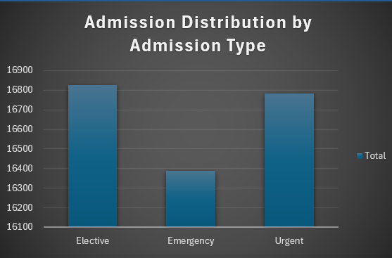
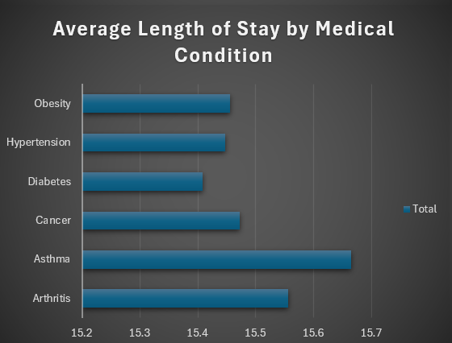
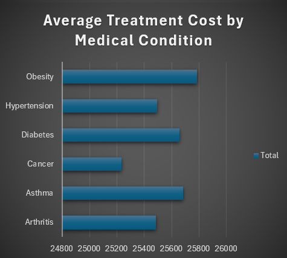
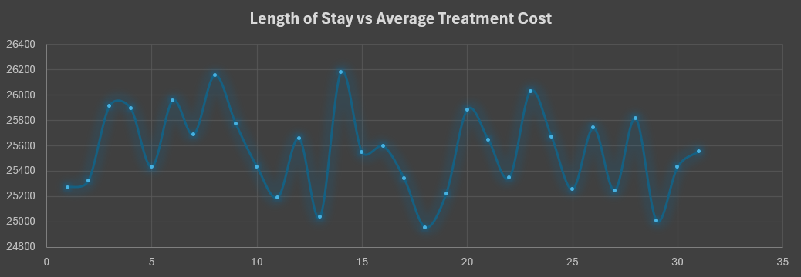
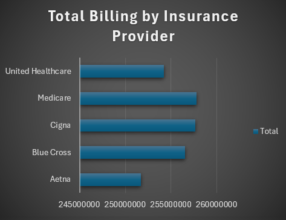
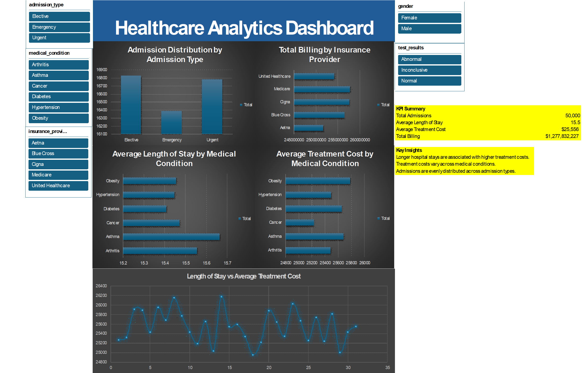

# Healthcare Analytics Project

## Project Overview

Healthcare organizations must balance patient care, operational efficiency, and financial performance. Understanding how patient characteristics and admission factors influence hospital utilization and treatment costs can help healthcare providers make more informed operational and financial decisions.

This project analyzes a healthcare dataset to explore patterns in **hospital admissions, length of stay, treatment costs, and insurance billing**. Using Excel and SQL, the analysis identifies relationships between patient characteristics, hospitalization duration, and treatment expenses.

The project demonstrates a complete data analytics workflow including **data cleaning, exploratory data analysis (EDA), SQL analysis, and dashboard development**. The final result is an interactive Excel dashboard that allows users to explore key healthcare metrics and trends.

---

# Business Question

**How do patient characteristics and admission factors influence hospital length of stay and treatment costs?**

Understanding these relationships can help healthcare administrators:

* Identify factors associated with longer hospital stays
* Understand drivers of treatment costs
* Evaluate hospital resource utilization
* Support data-driven decision making in healthcare operations

---

# Dataset

The dataset used in this project is a **synthetically generated healthcare dataset** designed to simulate hospital admission and billing records.

### Dataset Overview

* Initial records: **55,500**
* Final cleaned records: **50,000**
* Number of variables: **18**

### Key Variables

| Variable                | Description                                                                      |
| ----------------------- | -------------------------------------------------------------------------------- |
| name                    | Patient name                                                                     |
| age                     | Patient age                                                                      |
| gender                  | Patient gender                                                                   |
| blood_type              | Blood type classification                                                        |
| medical_condition       | Diagnosed medical condition                                                      |
| admission_type          | Admission category (Emergency, Elective, Urgent)                                 |
| hospital                | Hospital where treatment occurred                                                |
| doctor                  | Treating physician                                                               |
| admission_date          | Date of hospital admission                                                       |
| discharge_date          | Date of discharge                                                                |
| length_of_stay          | Calculated hospitalization duration                                              |
| billing_amount          | Original billing amount                                                          |
| adjustment_flag         | Indicates whether the billing record represents a charge or a billing adjustment |
| adjusted_billing_amount | Billing value excluding negative adjustments for cost analysis                   |
| insurance_provider      | Insurance company responsible for billing                                        |
| medication              | Medication prescribed                                                            |
| test_results            | Diagnostic test results                                                          |
| room_number             | Assigned hospital room                                                           |

Because the dataset is synthetic, it is used primarily to demonstrate **data analysis techniques rather than real-world healthcare trends**.

---

# Data Cleaning

Before performing analysis, the dataset was inspected and prepared to ensure data quality and consistency.

### Duplicate Records

The dataset initially contained **55,500 records**.

First, exact duplicate rows were removed using Excel’s **Remove Duplicates** function across all columns.

* **534 exact duplicate records** were removed.

Further inspection revealed an additional duplication pattern where records were identical across all columns **except the age column**. To resolve this issue, duplicates were removed again while **excluding the age column from the comparison criteria**.

After completing this process, the dataset was reduced to:

**50,000 cleaned records**

---

### Missing Values

The dataset was checked for missing values using Excel’s **Go To Special → Blanks** feature.

Result:

* No missing values were detected across any variables.

---

### Text Standardization

The **name** column contained inconsistent capitalization formats. The following Excel functions were applied to standardize formatting and remove extra spaces:

```
PROPER(TRIM(name))
```

This ensured consistent capitalization and removed potential leading or trailing whitespace.

---

### Date Validation

The dataset includes two date fields:

* admission_date
* discharge_date

A validation check confirmed that **discharge dates were never earlier than admission dates**, ensuring that hospitalization durations were logically consistent.

---

### Billing Amount Adjustments

Some records contained **negative billing values**, which may represent billing adjustments or refunds.

To preserve transparency while supporting cost analysis:

* The original **billing_amount** column was retained.
* A new column **adjustment_flag** was created to identify whether the record represents a billing charge or adjustment.
* A new column **adjusted_billing_amount** was created to keep only positive billing values for financial analysis.

This approach allows accurate cost analysis while maintaining the integrity of the original billing data.

---

### Derived Variable: Length of Stay

A new column called **length_of_stay** was created to calculate hospitalization duration.

Formula used:

```
Length of Stay = discharge_date − admission_date
```

This variable enables analysis of hospital utilization and patient stay patterns.

---

# Exploratory Data Analysis

Exploratory analysis was conducted to identify patterns in hospital admissions, treatment costs, and hospitalization duration.

### Admission Distribution by Admission Type



Admissions were analyzed across the following categories:

* Emergency
* Elective
* Urgent

The dataset shows a relatively balanced distribution across admission types. This pattern is expected because the dataset is synthetic and designed to provide equal representation across categories.

---

### Average Length of Stay by Medical Condition



The average **length of stay** was calculated for each medical condition.

This analysis highlights how different diagnoses can influence hospitalization duration. Some conditions are associated with longer hospital stays, indicating potentially higher treatment complexity or longer recovery periods.

---

### Average Treatment Cost by Medical Condition



Average treatment costs were analyzed using the **adjusted_billing_amount** variable.

Results show variation in treatment costs across medical conditions. Differences may reflect variations in treatment procedures, diagnostic testing, or care requirements.

---

### Relationship Between Length of Stay and Treatment Cost



The relationship between hospitalization duration and treatment cost was explored by analyzing the **average adjusted billing amount for each length of stay**.

The analysis suggests a **positive relationship between hospital stay duration and treatment cost**. Longer hospital stays generally correspond with higher treatment expenses due to additional services and extended care.

---

### Total Billing by Insurance Provider



Billing totals were aggregated by **insurance provider** to examine revenue distribution across insurers.

Because the dataset is synthetic, billing totals appear relatively balanced across providers. However, this analysis demonstrates how hospitals can evaluate revenue sources across payer groups.

---

# SQL Analysis

SQL was used to perform additional analysis and generate summary statistics supporting the project’s business question.

### Average Length of Stay by Medical Condition

This query calculates the **average length of stay for each medical condition**, helping identify which conditions tend to require longer hospitalizations.

```sql
SELECT medical_condition, ROUND(AVG(length_of_stay), 2) AS average_stay
FROM healthcare_dataset_final
GROUP BY medical_condition
ORDER BY average_stay DESC;
```

---

### Total Revenue by Insurance Provider

This query calculates the **total adjusted billing amount by insurance provider**, showing which insurers generate the largest billing totals.

```sql
SELECT insurance_provider, ROUND(SUM(adjusted_billing_amount), 2) AS insurance_revenue
FROM healthcare_dataset_final
GROUP BY insurance_provider
ORDER BY insurance_revenue DESC;
```

---

### Admission Distribution by Admission Type

This query summarizes the **number and percentage of admissions by admission type**, helping show how patients enter the hospital system.

```sql
SELECT
    admission_type,
    number_of_admissions,
    ROUND((number_of_admissions * 100.0 / SUM(number_of_admissions) OVER()), 2) AS percentage_of_admissions
FROM (
    SELECT
        admission_type,
        COUNT(name) AS number_of_admissions
    FROM healthcare_dataset_final
    GROUP BY admission_type
) AS admission_table
ORDER BY number_of_admissions DESC;
```

---

### Average Billing Amount by Medical Condition

This query calculates the **average adjusted billing amount for each medical condition**, helping identify which conditions are most expensive to treat.

```sql
SELECT medical_condition, ROUND(AVG(adjusted_billing_amount), 2) AS average_billing_amount
FROM healthcare_dataset_final
GROUP BY medical_condition
ORDER BY average_billing_amount DESC;
```

---

### Length of Stay vs Billing Amount

This query analyzes the relationship between **hospitalization duration and treatment cost** by calculating the admission count and average billing amount for each length-of-stay value.

```sql
SELECT
    length_of_stay,
    COUNT(*) AS admission_count,
    ROUND(AVG(adjusted_billing_amount), 2) AS avg_billing_amount
FROM healthcare_dataset_final
GROUP BY length_of_stay
ORDER BY length_of_stay ASC;
```

---

# Dashboard



An interactive Excel dashboard was developed to visually summarize key insights from the dataset.

The dashboard includes the following visualizations:

* Admission Distribution by Admission Type
* Average Length of Stay by Medical Condition
* Average Treatment Cost by Medical Condition
* Length of Stay vs Treatment Cost
* Total Billing by Insurance Provider

The dashboard was built using **PivotTables, PivotCharts, and slicers**, allowing users to dynamically filter the data and explore trends across different patient groups.

### Interactive Filters

The dashboard includes slicers that allow filtering by:

* Admission Type
* Medical Condition
* Insurance Provider
* Gender
* Test Results

When filters are applied, all dashboard visualizations update simultaneously, enabling users to explore relationships between hospitalization duration, treatment costs, and patient characteristics.

---

# Business Recommendations

Based on the findings from the exploratory and SQL analysis, several recommendations can help healthcare organizations improve operational efficiency and cost management.

### Monitor High-Cost Medical Conditions

Hospitals should track medical conditions associated with higher treatment costs or longer hospital stays. Identifying these conditions can help improve treatment planning and resource allocation.

---

### Optimize Hospital Length of Stay

Since longer hospital stays tend to increase treatment costs, hospitals should explore opportunities to improve care coordination and discharge planning to reduce unnecessary hospitalization duration.

---

### Improve Financial Monitoring

Healthcare organizations should maintain strong oversight of billing adjustments and financial reporting to ensure accurate tracking of treatment costs and reimbursements.

---

### Leverage Data Analytics for Decision-Making

Hospitals can benefit from implementing data analytics solutions to better understand patient admission patterns, cost drivers, and resource utilization. Data-driven insights can support better operational planning and improved healthcare outcomes.

---

This project demonstrates how healthcare data can be analyzed to identify patterns in **hospital utilization, treatment costs, and patient admissions**, providing insights that support more informed healthcare management decisions.
